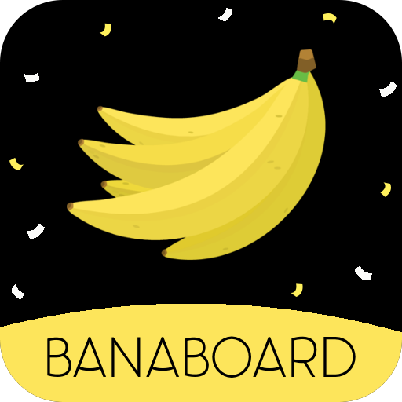
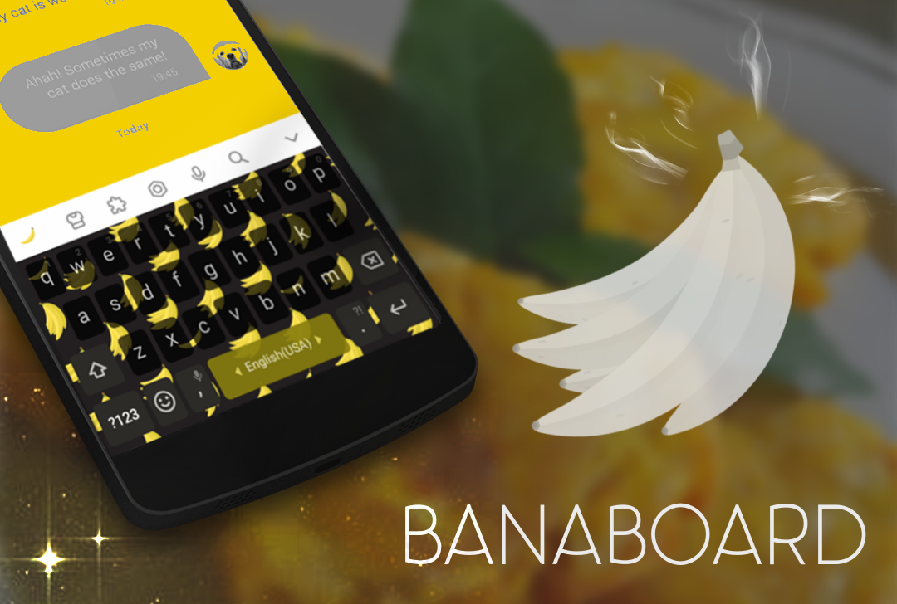
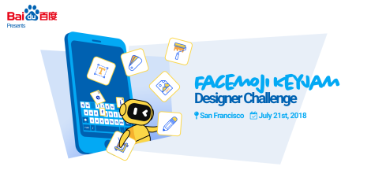
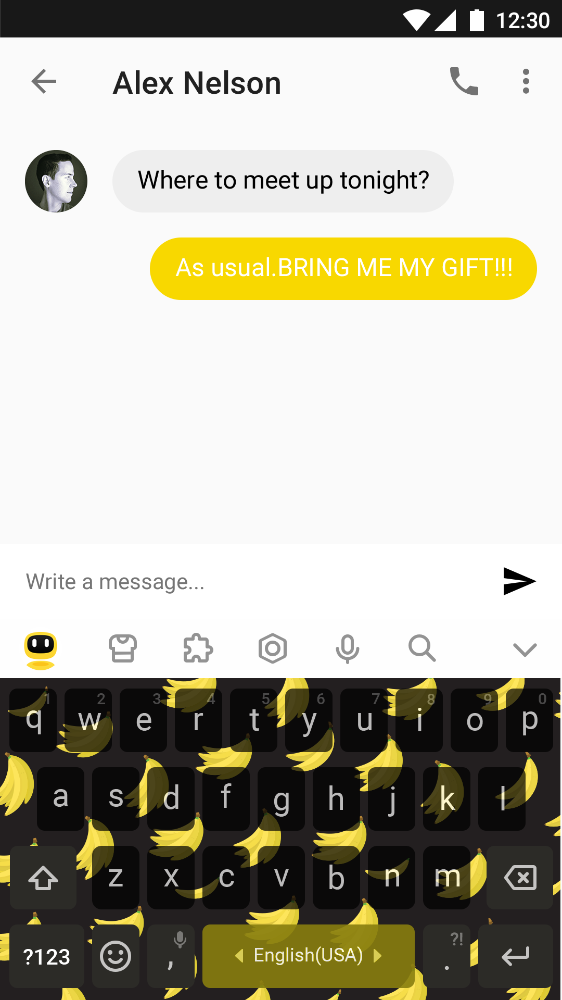
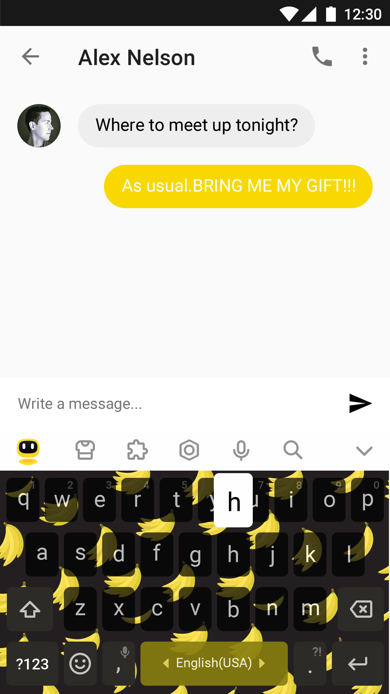
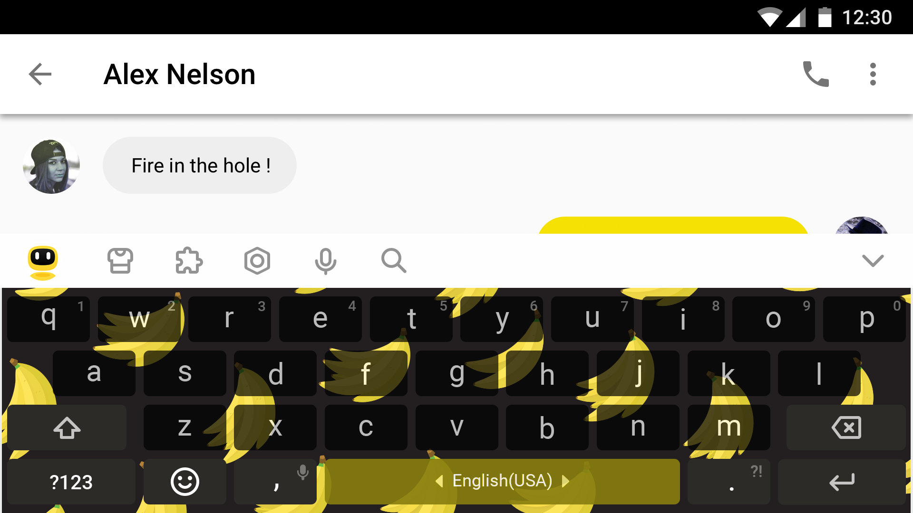

# Banaboard :: Facemoji - KeyJam 2018

*A keyboard to go bananas for...*

### Event

Facemoji hosted a design jam/hackathon at Covo, San Francisco, with the goal
on setting up a challenge to design a new mobile keyboard for their mobile app.

- Date: July 21st, 2018
- Time: 12:00 - 18:00

Anything created at the event, remains personal property, even after the event
is over, so you can choose to keep it or sell it.

## Design

...

### Idea

...

### Color Palette

...

### Preview (screenshots)

## Tools

- Illustrator
- Gimp

## Attribution

- [Adrien Coquet - Panama Font](https://www.1001fonts.com/panama-font.html)
- [Christoper Jones - Banana Vector Pattern](http://www.blugraphic.com/2016/10/18/banana-vector-pattern-free-download/)
- [James Salter - Banner Background](http://animatethis.james-salter.com/wp-content/wverrors.php?getimage=aHR0cHM6Ly9ibHVlamVsbHliZWFucy5maWxlcy53b3JkcHJlc3MuY29tLzIwMTEvMDgvaW1ncDAyMTguanBn)
